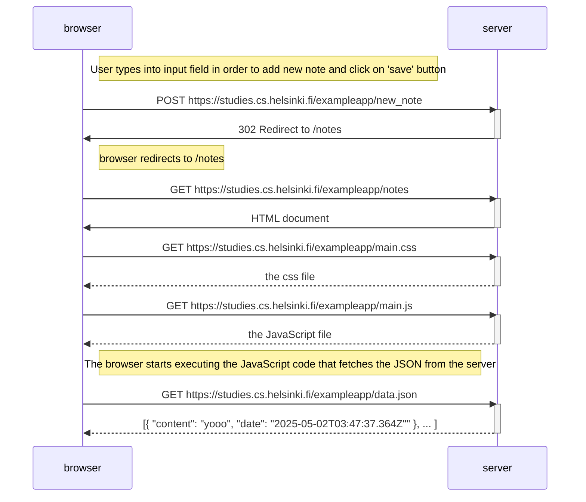

```mermaid
sequenceDiagram
    participant browser
    participant server

    Note right of browser: User types into input field in order to add new note and click on 'save' button

    browser->>server:POST https://studies.cs.helsinki.fi/exampleapp/new_note 
    activate server
    server->>browser: 302 Redirect to /notes
    deactivate server

    Note right of browser: browser redirects to /notes
    browser->>server:GET https://studies.cs.helsinki.fi/exampleapp/notes
    activate server
    server->>browser:  HTML document
    deactivate server

     browser->>server: GET https://studies.cs.helsinki.fi/exampleapp/main.css
    activate server
    server-->>browser: the css file
    deactivate server

    browser->>server: GET https://studies.cs.helsinki.fi/exampleapp/main.js
    activate server
    server-->>browser: the JavaScript file
    deactivate server

    Note right of browser: The browser starts executing the JavaScript code that fetches the JSON from the server

    browser->>server: GET https://studies.cs.helsinki.fi/exampleapp/data.json
    activate server
    server-->>browser: [{ "content": "yooo", "date": "2025-05-02T03:47:37.364Z"" }, ... ]
    deactivate server
  
```
   

   
