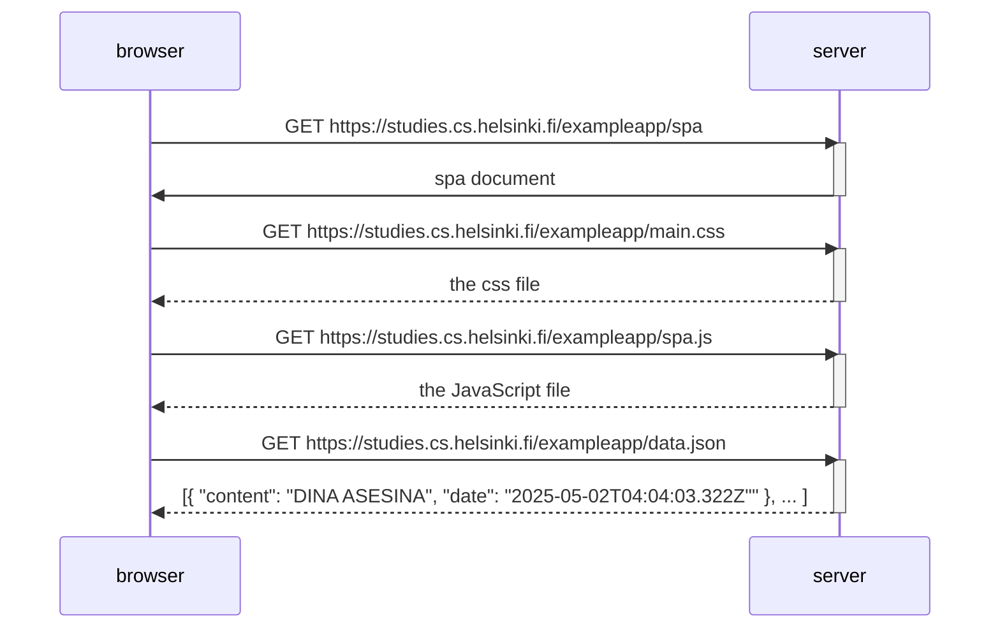

```mermaid
sequenceDiagram
participant browser
participant server

browser->>server: GET https://studies.cs.helsinki.fi/exampleapp/spa
activate server
server->>browser: spa document
deactivate server

  browser->>server: GET https://studies.cs.helsinki.fi/exampleapp/main.css
    activate server
    server-->>browser: the css file
    deactivate server

    browser->>server: GET https://studies.cs.helsinki.fi/exampleapp/spa.js
    activate server
    server-->>browser: the JavaScript file
    deactivate server

    browser->>server: GET https://studies.cs.helsinki.fi/exampleapp/data.json
    activate server
    server-->>browser: [{ "content": "DINA ASESINA", "date": "2025-05-02T04:04:03.322Z"" }, ... ]
    deactivate server


```
